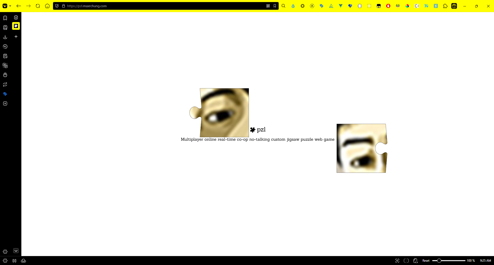
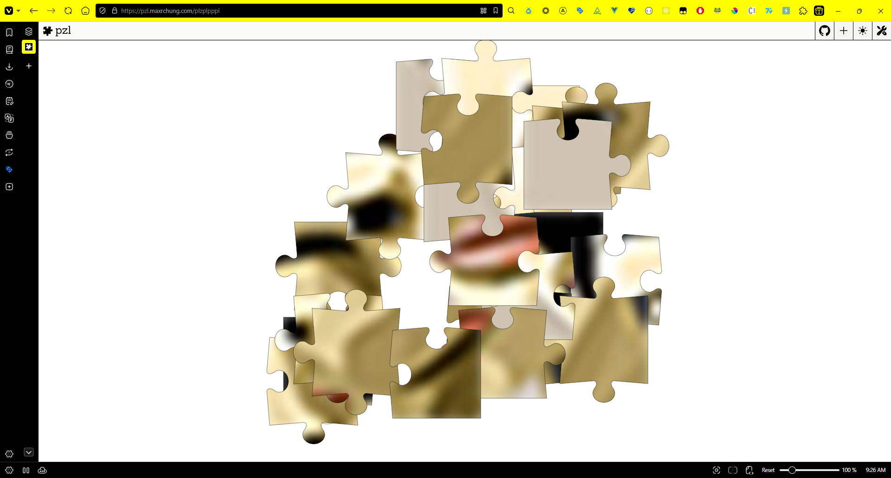
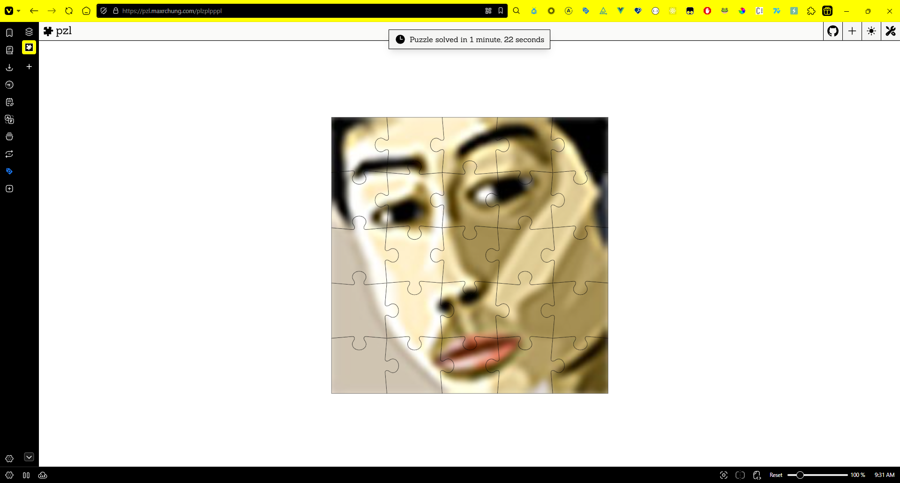
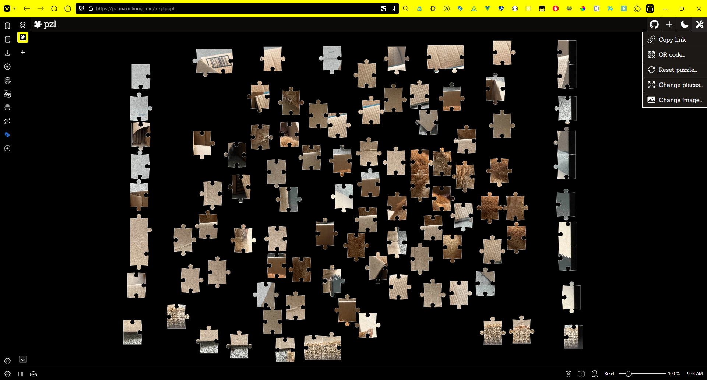

# pzl

Multiplayer online real-time co-op no-talking custom jigsaw puzzle web game

<https://pzl.maxrchung.com>

## Features

- Jigsaw puzzle shapes drawn with [Vue Konva](https://konvajs.org/docs/vue/index.html)
- Real-time multiplayer collaboration with [Socket.IO](https://socket.io)
- Mobile support
- Create your own lobbies
- Share with QR code
- Upload custom image
- Change number of pieces
- Zoom in/out
- Dark and light themes

## Screenshots









## Dev notes

### Debug

Use "Debug all" option in debug tab of VS Code. It launches debug server, client, and
Chrome altogether.

### Amplify

Amplify automatically builds the Vue client on push and deploys a static site.

### CDK

I'm using S3 to presign URLs and upload images. You would think this could be
easily set up through Amplify Storage, but Amplify doesn't let you have public
S3 access. I want public read access so users can indefinitely access images at
permanent locations.

So next I turned to CDK, but I had trouble running CDK with NX. The CDK NX
plugins are either outdated, so don't work with the latest NX, or so opinionated
(@aws/nx-plugin) that it's painful to integrate with even the basic constructs.
I just want a public S3 god damn.

So I ended up just rolling a simple embedded CDK project, which is not standard
but simple enough. You'll need to `cd` into the `cdk` folder to do commands.

### Railway

Railway automatically builds the socket.io server on push and deploys a Docker
container.

### Docker Hub

This isn't really necessary since Railway builds and deploys the server on push,
but if you ever want to push the server to Docker Hub you can do this:

```sh
docker build . -t chngmx/pzl
docker push chngmx/pzl
```
